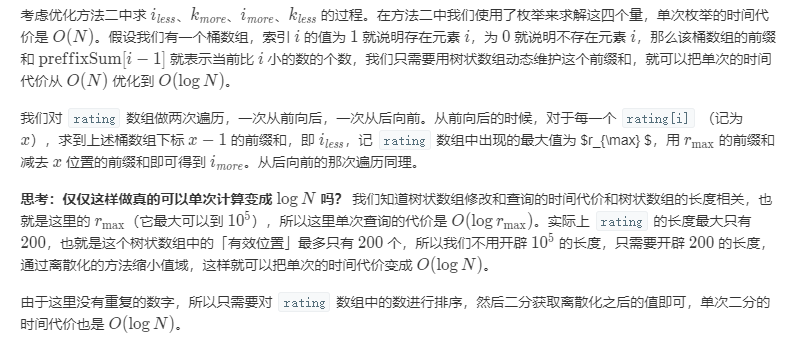

Title：[#1395. 统计作战单位数](https://leetcode-cn.com/problems/count-number-of-teams/)


<!-- @import "[TOC]" {cmd="toc" depthFrom=1 depthTo=6 orderedList=false} -->

<!-- code_chunk_output -->

- [问题描述](#问题描述)
- [测试样例](#测试样例)
- [解题方案](#解题方案)
  - [1 暴力解法——O(n^3)](#1-暴力解法on3)
  - [2 中间二分法  O(n^2)](#2-中间二分法-on2)
  - [3 python 内置函数 combinations from itertools](#3-python-内置函数-combinations-from-itertools)
  - [4 离散化树状数组](#4-离散化树状数组)

<!-- /code_chunk_output -->


# 问题描述
 n 名士兵站成一排。每个士兵都有一个 独一无二 的评分 rating 。

每 3 个士兵可以组成一个作战单位，分组规则如下：

从队伍中选出下标分别为 i、j、k 的 3 名士兵，他们的评分分别为 rating[i]、rating[j]、rating[k]
作战单位需满足： rating[i] < rating[j] < rating[k] 或者 rating[i] > rating[j] > rating[k] ，其中  0 <= i < j < k < n
请你返回按上述条件可以组建的作战单位数量。每个士兵都可以是多个作战单位的一部分。

# 测试样例
示例 1：

输入：rating = [2,5,3,4,1]
输出：3
解释：我们可以组建三个作战单位 (2,3,4)、(5,4,1)、(5,3,1) 。
示例 2：

输入：rating = [2,1,3]
输出：0
解释：根据题目条件，我们无法组建作战单位。
示例 3：

输入：rating = [1,2,3,4]
输出：4
 

提示：

n == rating.length
1 <= n <= 200
1 <= rating[i] <= 10^5

# 解题方案
##  1 暴力解法——O(n^3)


```python
#PYTHON
class Solution(object):
    def numTeams(self, rating):
        """
        :type rating: List[int]
        :rtype: int
        """
        output = 0
        for i in range(0,len(rating)-2):
            for j in range(i+1,len(rating)-1):
                for k in range(j+1,len(rating)):
                    if rating[i]<rating[j] and rating[j]<rating[k]:
                        output = output+1
                        print(rating[i],rating[j],rating[k])
                    if rating[i]>rating[j] and rating[j]>rating[k]:
                        output = output+1
                        print(rating[i],rating[j],rating[k])
        return output
```
```C++
//C++
class Solution {
public:
    int numTeams(vector<int>& rating) {
        int count=0;
        for(int i=0;i<rating.size()-2;i++)
        for(int j=i+1;j<rating.size()-1;j++)
        for(int k=j+1;k<rating.size();k++)
        {
            if((rating[i]<rating[j])&&(rating[j]<rating[k]))
            count++;
            else if((rating[i]>rating[j])&&(rating[j]>rating[k]))
            count++;
        }
        return count;
    }
};
```
## 2 中间二分法  O(n^2)
在rating[i]<rating[j]rating[k]的情形中，以rating[j]为分界，满足该类型的总数为

$ sum（rating[i]<rating[j]）* sum（rating[i]<rating[k]）$


```python
#PYTHON
class Solution2(object):
    def numTeams(self, rating):
        """
        :type rating: List[int]
        :rtype: int
        """
        output = 0
        n = len(rating)
        for i in range(1,n-1):
            left_lower = 0
            left_big = 0
            right_lower = 0
            right_big = 0 
            for j in range(0,i):
                if rating[j]<rating[i]:
                    left_lower = left_lower+1
                if rating[j]>rating[i]:
                    left_big = left_big+1
            for k in range(i+1,n):
                if rating[k]>rating[i]:
                    right_big = right_big+1
                if rating[k]<rating[i]:
                    right_lower = right_lower+1
            output = output + (left_big*right_lower + left_lower*right_big)                       
        return output
```
```C++
//C++
class Solution {
public:
    int numTeams(vector<int>& rating) {
        int count=0;
        for(int i=1;i<rating.size()-1;i++)
        {
            int lscount=0;
            int llcount=0;
            int rscount=0;
            int rlcount=0;
            for(int j=i-1;j>=0;j--)
            {
                if(rating[j]>rating[i])
                llcount++;
                else
                lscount++;
            }
            for(int k=i+1;k<rating.size();k++)
            {
                if(rating[k]>rating[i])
                rlcount++;
                else
                rscount++;
            }
            count=llcount*rscount+lscount*rlcount+count;

        }
        return count;
    }
};
```

## 3 python 内置函数 combinations from itertools
combinations 可以枚举所有组合
eg：


```python
#PYTHON
from itertools import combinations
List = list(combinations([1,2,3,4],3))
print(List)
```

    [(1, 2, 3), (1, 2, 4), (1, 3, 4), (2, 3, 4)]
    


```python
#PYTHON
class Solution3(object):
    def numTeams(self, rating):
        """
        :type rating: List[int]
        :rtype: int
        """
        output = 0
        n = len(rating)
        from itertools import combinations
        List = list(combinations(rating,3))
        for i in List:
            if i[0]<i[1]<i[2] or i[0]>i[1]>i[2]:
                output = output+1                  
        return output
```

## 4 离散化树状数组


前置知识

离散化思想，在不改变数据相对大小的条件下，对数据进行相应的缩小。
树状数组（二元索引树），一种动态维护前缀和的数据结构。

思路


代码
```C++
//C++
class Solution {
public:
    static constexpr int MAX_N = 200 + 5;

    int c[MAX_N];
    vector <int> disc;
    vector <int> iLess, iMore, kLess, kMore;

    int lowbit(int x) {
        return x & (-x);
    }

    void add(int p, int v) {
        while (p < MAX_N) {
            c[p] += v;
            p += lowbit(p);
        }
    }

    int get(int p) {
        int r = 0;
        while (p > 0) {
            r += c[p];
            p -= lowbit(p);
        }
        return r;
    }

    int numTeams(vector<int>& rating) {
        disc = rating;
        disc.push_back(-1);
        sort(disc.begin(), disc.end());
        auto getId = [&] (int target) {
            return lower_bound(disc.begin(), disc.end(), target) - disc.begin();
        };


        iLess.resize(rating.size());
        iMore.resize(rating.size());
        kLess.resize(rating.size());
        kMore.resize(rating.size());

        for (int i = 0; i < rating.size(); ++i) {
            auto id = getId(rating[i]);
            iLess[i] = get(id);
            iMore[i] = get(201) - get(id); 
            add(id, 1);
        }

        memset(c, 0, sizeof c);
        for (int i = rating.size() - 1; i >= 0; --i) {
            auto id = getId(rating[i]);
            kLess[i] = get(id);
            kMore[i] = get(201) - get(id); 
            add(id, 1);
        }
        
        int ans = 0;
        for (unsigned i = 0; i < rating.size(); ++i) {
            ans += iLess[i] * kMore[i] + iMore[i] * kLess[i];
        }

        return ans;
    }
};
```