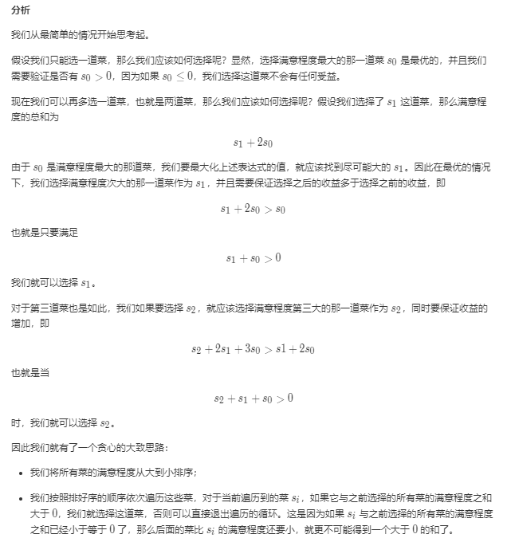
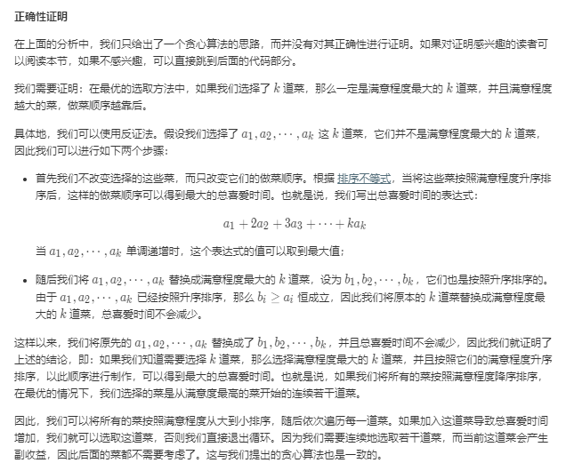

[#1402. 做菜顺序](https://leetcode-cn.com/problems/reducing-dishes/)

# 题目描述
一个厨师收集了他 n 道菜的满意程度 satisfaction ，这个厨师做出每道菜的时间都是 1 单位时间。

一道菜的 「喜爱时间」系数定义为烹饪这道菜以及之前每道菜所花费的时间乘以这道菜的满意程度，也就是 time[i]*satisfaction[i] 。

请你返回做完所有菜 「喜爱时间」总和的最大值为多少。

你可以按 任意 顺序安排做菜的顺序，你也可以选择放弃做某些菜来获得更大的总和。


# 测试样例
示例 1：

输入：satisfaction = [-1,-8,0,5,-9]
输出：14
解释：去掉第二道和最后一道菜，最大的喜爱时间系数和为 (-1*1 + 0*2 + 5*3 = 14) 。每道菜都需要花费 1 单位时间完成。
示例 2：

输入：satisfaction = [4,3,2]
输出：20
解释：按照原来顺序相反的时间做菜 (2*1 + 3*2 + 4*3 = 20)
示例 3：

输入：satisfaction = [-1,-4,-5]
输出：0
解释：大家都不喜欢这些菜，所以不做任何菜可以获得最大的喜爱时间系数。
示例 4：

输入：satisfaction = [-2,5,-1,0,3,-3]
输出：35

提示：

n == satisfaction.length
1 <= n <= 500
-10^3 <= satisfaction[i] <= 10^3

# 解题思路
## 暴力法
```c++
class Solution {
public:
    int maxSatisfaction(vector<int>& satisfaction) {
        sort(satisfaction.begin(),satisfaction.end());
        int res=0;
         for(int i=0;i<satisfaction.size();i++)
         {
                int sum=0;
                for(int j=0;j<satisfaction.size();j++)
                {
                    sum=sum+(j+1)*satisfaction[j];
                }
                res=max(res,sum);
                vector<int>::iterator k = satisfaction.begin();
                satisfaction.erase(k);//删除第一个元素
         }
         return res;
    }
};
```
执行用时 : 8 ms, 在所有 C++ 提交中击败了53.94%的用户
内存消耗 : 6.7 MB, 在所有 C++ 提交中击败了100.00%的用户

## 贪心算法



代码
```c++
class Solution {
public:
    int maxSatisfaction(vector<int>& satisfaction) {
        sort(satisfaction.begin(), satisfaction.end(), greater<int>());
        int presum = 0, ans = 0;
        for (int si: satisfaction) {
            if (presum + si > 0) {
                presum += si;
                ans += presum;
            }
            else {
                break;
            }
        }
        return ans;
    }
};
```
复杂度分析

时间复杂度：O(N \log N)O(NlogN)，我们需要对满意程度进行排序。

空间复杂度：O(\log N)O(logN)，使用语言自带的排序，空间复杂度为 O(\log N)O(logN)。如果使用堆排序，空间复杂度可以降低至 O(1)O(1)。

执行用时 : 0 ms, 在所有 C++ 提交中击败了100.00%的用户
内存消耗 : 6.7 MB, 在所有 C++ 提交中击败了100.00%的用户
