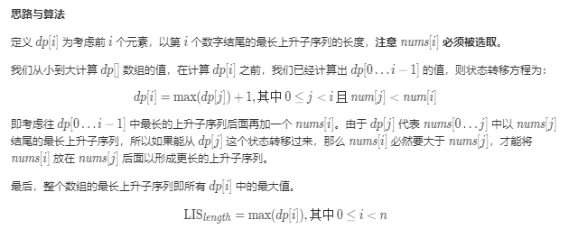
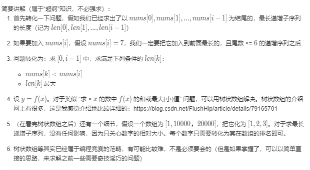

[# 最长上升子序列](https://leetcode-cn.com/problems/longest-increasing-subsequence/)

# 题目描述
给定一个无序的整数数组，找到其中最长上升子序列的长度。

# 测试样例
示例:

输入: [10,9,2,5,3,7,101,18]
输出: 4 
解释: 最长的上升子序列是 [2,3,7,101]，它的长度是 4。
说明:

可能会有多种最长上升子序列的组合，你只需要输出对应的长度即可。
你算法的时间复杂度应该为 O(n2) 。
进阶: 你能将算法的时间复杂度降低到 O(n log n) 吗?

# 解题思路
## S1动态规划

```c++
class Solution {
public:
    int lengthOfLIS(vector<int>& nums) {
        int n=(int)nums.size();
        if (n == 0) return 0;
        vector<int> dp(n, 0);
        for (int i = 0; i < n; ++i) {
            dp[i] = 1;
            for (int j = 0; j < i; ++j) {
                if (nums[j] < nums[i]) {
                    dp[i] = max(dp[i], dp[j] + 1);
                }
            }
        }
        return *max_element(dp.begin(), dp.end());
    }
};
```

## S2二分+动态规划
```c++
class Solution {
public:
    int lengthOfLIS(vector<int>& nums) {
        int n=nums.size();
        vector<int>dp(n,INT_MAX);
        int ans=0;
        for(auto v:nums){
            int p=lower_bound(dp.begin(),dp.end(),v)-dp.begin();
            dp[p]=v;
            ans=max(ans,p+1);
        }
        return ans;
    }
};

```
时间复杂度为n(logn)
## S3 树状数组解法

```c++
class Solution {
public:
    int lengthOfLIS(vector<int>& nums) {
        // 用树状数组找到在小于当前数字的数中，递增序列长度的最大值。(类似区间极大值)
        // 树状数组求区间极大值时，只要区间是从 1 开始的，就可以直接用区间和的思路
        vector<int> numsort(nums.begin(), nums.end());
        sort(numsort.begin(), numsort.end());
        int tree[nums.size() + 1] = {0}, res = 0;
        for(int i : nums)
        {
            int before = 0;
            int rk = lower_bound(numsort.begin(), numsort.end(), i) - numsort.begin();
            for(int t = rk; t > 0; t -= ((t) & (-t))) before = max(before, tree[t]);
            res = max(res, before + 1);
            for(int t = rk + 1; t <= nums.size(); t += ((t) & (-t))) tree[t] = max(tree[t], before + 1);
        }
        return res;
    }
};

```