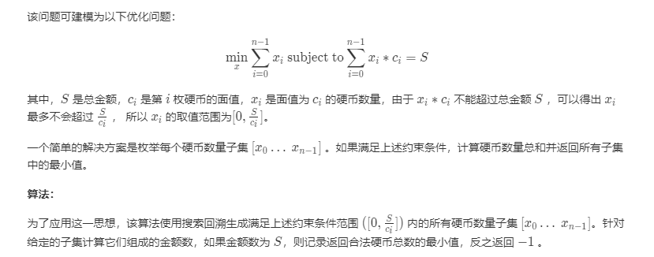
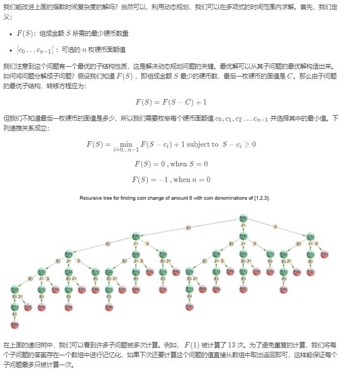
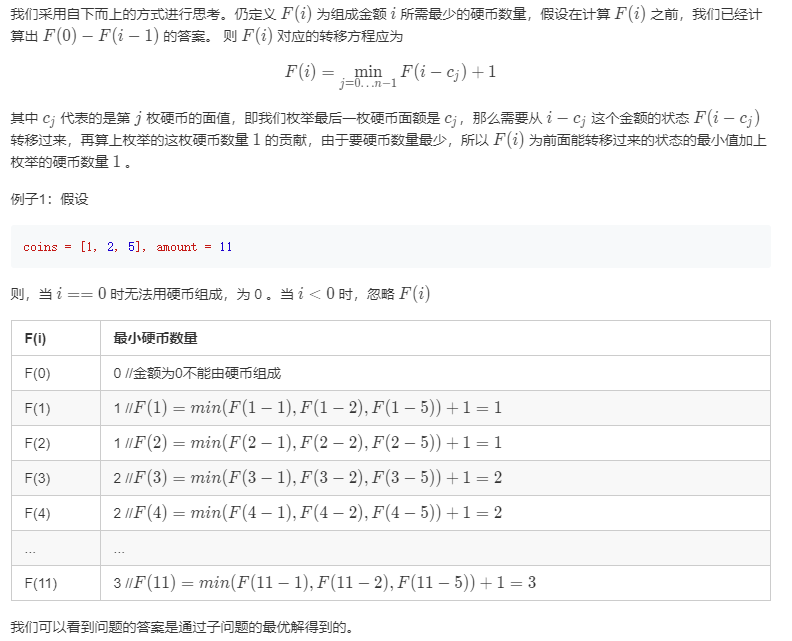
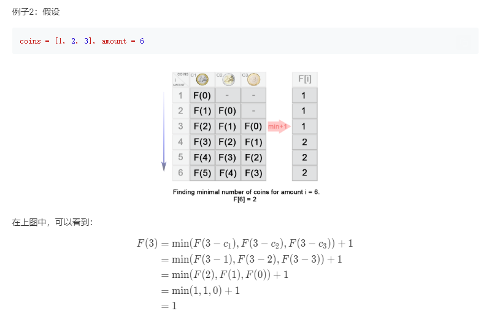
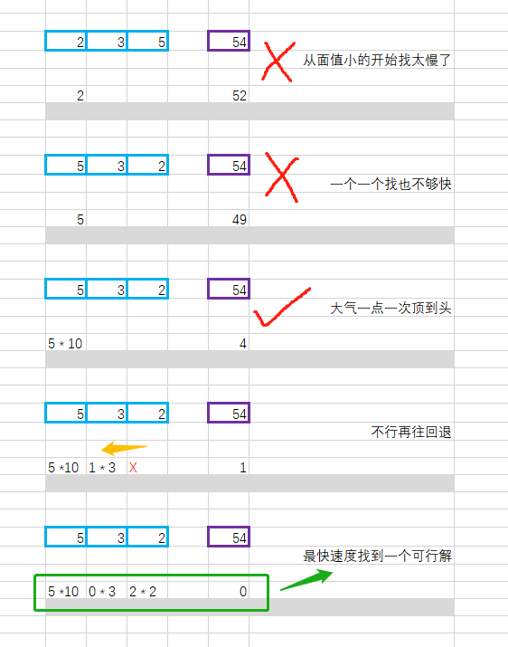

[#322. 零钱兑换](https://leetcode-cn.com/problems/coin-change/)


<!-- @import "[TOC]" {cmd="toc" depthFrom=1 depthTo=6 orderedList=false} -->

<!-- code_chunk_output -->

- [问题描述](#问题描述)
- [测试样例](#测试样例)
- [解题方案](#解题方案)
  - [S1 搜索回溯 (超时)](#s1-搜索回溯-超时)
  - [S2 动态规划-自上而下](#s2-动态规划-自上而下)
  - [S3 动态规划-自下而上](#s3-动态规划-自下而上)
  - [S4 贪心 + dfs](#s4-贪心-dfs)
- [总结与拓展](#总结与拓展)

<!-- /code_chunk_output -->

# 问题描述
给定不同面额的硬币 coins 和一个总金额 amount。编写一个函数来计算可以凑成总金额所需的最少的硬币个数。如果没有任何一种硬币组合能组成总金额，返回 -1。

# 测试样例
示例 1:

输入: coins = [1, 2, 5], amount = 11
输出: 3 
解释: 11 = 5 + 5 + 1

示例 2:

输入: coins = [2], amount = 3
输出: -1
 
说明:
你可以认为每种硬币的数量是无限的。

# 解题方案
## S1 搜索回溯 (超时)


代码：
```C++
//C++
class Solution {
    int coinChange(int idxCoin, vector<int>& coins, int amount) {
        if (amount == 0) return 0;
        if (idxCoin < coins.size() && amount > 0) {
            int maxVal = amount / coins[idxCoin];
            int minCost = INT_MAX;
            for (int x = 0; x <= maxVal; x++) {
                if (amount >= x * coins[idxCoin]) {
                    int res = coinChange(idxCoin + 1, coins, amount - x * coins[idxCoin]);
                    if (res != -1) minCost = min(minCost, res + x);
                }
            }
            return minCost == INT_MAX ? -1: minCost;
        }
        return -1;
    }
public:
    int coinChange(vector<int>& coins, int amount) {
        return coinChange(0, coins, amount);
    }
};

// Time Limit Exceeded

```
## S2 动态规划-自上而下


代码  
```c++
//c++
class Solution {
    vector<int>count;
    int dp(vector<int>& coins, int rem) {
        if (rem < 0) return -1;
        if (rem == 0) return 0;
        if (count[rem - 1] != 0) return count[rem - 1];
        int Min = INT_MAX;
        for (int coin:coins) {
            int res = dp(coins, rem - coin);
            if (res >= 0 && res < Min) {
                Min = res + 1;
            }
        }
        count[rem - 1] = Min == INT_MAX ? -1 : Min;
        return count[rem - 1];
    }
public:
    int coinChange(vector<int>& coins, int amount) {
        if (amount < 1) return 0;
        count.resize(amount);
        return dp(coins, amount);
    }
};

```
```python
#python
import functools

class Solution:
    def coinChange(self, coins: List[int], amount: int) -> int:
        @functools.lru_cache(amount)
        def dp(rem):
            if rem < 0: return -1
            if rem == 0: return 0
            mini = int(1e9)
            for coin in self.coins:
                res = dp(rem - coin)
                if res >= 0 and res < mini:
                    mini = res + 1
            return mini if mini < int(1e9) else -1

        self.coins = coins
        if amount < 1: return 0
        return dp(amount)

```
复杂度分析

时间复杂度：O(Sn)O(Sn)，其中 SS 是金额，nn 是面额数。我们一共需要计算 SS 个状态的答案，且每个状态 F(S)F(S) 由于上面的记忆化的措施只计算了一次，而计算一个状态的答案需要枚举 nn 个面额值，所以一共需要 O(Sn)O(Sn) 的时间复杂度。  
空间复杂度：O(S)O(S)，我们需要额外开一个长为 SS 的数组来存储计算出来的答案 F(S)F(S) 。

## S3 动态规划-自下而上
  


代码  
```c++
//c++
class Solution {
public:
    int coinChange(vector<int>& coins, int amount) {
        int Max = amount + 1;
        vector<int> dp(amount + 1, Max);
        dp[0] = 0;
        for (int i = 1; i <= amount; ++i) {
            for (int j = 0; j < (int)coins.size(); ++j) {
                if (coins[j] <= i) {
                    dp[i] = min(dp[i], dp[i - coins[j]] + 1);
                }
            }
        }
        return dp[amount] > amount ? -1 : dp[amount];
    }
};

```
```python
#python
class Solution:
    def coinChange(self, coins: List[int], amount: int) -> int:
        dp = [float('inf')] * (amount + 1)
        dp[0] = 0
        
        for coin in coins:
            for x in range(coin, amount + 1):
                dp[x] = min(dp[x], dp[x - coin] + 1)
        return dp[amount] if dp[amount] != float('inf') else -1 

```

复杂度分析

时间复杂度：O(Sn)O(Sn)，其中 SS 是金额，nn 是面额数。我们一共需要计算 O(S)O(S) 个状态，SS 为题目所给的总金额。对于每个状态，每次需要枚举 nn 个面额来转移状态，所以一共需要 O(Sn)O(Sn) 的时间复杂度。

空间复杂度：O(S)O(S)。DP 数组需要开长度为总金额 SS 的空间。

## S4 贪心 + dfs
解题思路
1、贪心

 想要总硬币数最少，肯定是优先用大面值硬币，所以对 coins 按从大到小排序

 先丢大硬币，再丢会超过总额时，就可以递归下一层丢的是稍小面值的硬币

2、乘法对加法的加速

 优先丢大硬币进去尝试，也没必要一个一个丢，可以用乘法算一下最多能丢几个

k = amount / coins[c_index] 计算最大能投几个
amount - k * coins[c_index] 减去扔了 k 个硬币
count + k 加 k 个硬币

如果因为丢多了导致最后无法凑出总额，再回溯减少大硬币数量

3、最先找到的并不是最优解

注意不是现实中发行的硬币，面值组合规划合理，会有奇葩情况

考虑到有 [1,7,10] 这种用例，按照贪心思路 10 + 1 + 1 + 1 + 1 会比 7 + 7 更早找到

所以还是需要把所有情况都递归完

4、ans 疯狂剪枝

 贪心虽然得不到最优解，但也不是没用的

 我们快速算出一个贪心的 ans 之后，虽然还会有奇葩情况，但是绝大部分普通情况就可以疯狂剪枝了
 

代码
```c++
//c++
void coinChange(vector<int>& coins, int amount, int c_index, int count, int& ans)
{
    if (amount == 0)
    {
        ans = min(ans, count);
        return;
    }
    if (c_index == coins.size()) return;

    for (int k = amount / coins[c_index]; k >= 0 && k + count < ans; k--)//这一步可以借助ans实现疯狂剪枝，所以对比方法一回溯能不超时，这里就是合理利用了贪心
    {
        coinChange(coins, amount - k * coins[c_index], c_index + 1, count + k, ans);
    }
}

int coinChange(vector<int>& coins, int amount)
{
    if (amount == 0) return 0;
    sort(coins.rbegin(), coins.rend());
    int ans = INT_MAX;
    coinChange(coins, amount, 0, 0, ans);
    return ans == INT_MAX ? -1 : ans;
}

```
# 总结与拓展
这道题目解法涉及算法众多，回溯、动态规划、贪心+dfs。