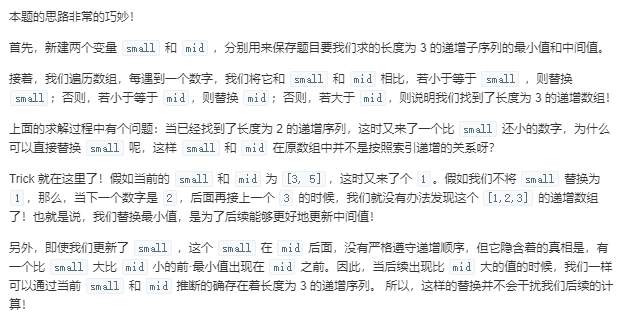

[#334.递增的三元子序列](https://leetcode-cn.com/problems/increasing-triplet-subsequence/)
# 题目描述
给定一个未排序的数组，判断这个数组中是否存在长度为 3 的递增子序列。

数学表达式如下:

如果存在这样的 i, j, k,  且满足 0 ≤ i < j < k ≤ n-1，
使得 arr[i] < arr[j] < arr[k] ，返回 true ; 否则返回 false 。
说明: 要求算法的时间复杂度为 O(n)，空间复杂度为 O(1) 。

# 测试样例
示例 1:

输入: [1,2,3,4,5]
输出: true
示例 2:

输入: [5,4,3,2,1]
输出: false

# 解题思路
## S1 动态规划
```c++
class Solution {
public:
    bool increasingTriplet(vector<int>& nums) {
        int n=(int)nums.size();
        if (n == 0) return 0;
        vector<int> dp(n, 0);
        for (int i = 0; i < n; ++i) {
            dp[i] = 1;
            for (int j = 0; j < i; ++j) {
                if (nums[j] < nums[i]) {
                    dp[i] = max(dp[i], dp[j] + 1);
                    if (dp[i]>=3)
                    return true;
                }
            }
        }
        return false;
    }
};
```
改进版
```c++
class Solution {
public:
    bool increasingTriplet(vector<int>& nums) {
        if (nums.size() < 3) return false;
        
        int dp[3];
        memset(dp, 0x7F, sizeof dp); //指定内存初始化函数，它将dp中的值全部赋为2139062143，这是用memset对int赋值所能达到的最大值
        
        for (int num : nums) {
            for (int i = 0; i < 3; ++i) {
                if (dp[i] < num) continue;
                if (i == 2) return true;
                dp[i] = num;
                break;
            }
        }
        
        return false;
    }
};

```

## S2 巧妙算法

```C++
class Solution {
public:
  bool increasingTriplet(vector<int>& nums) {
    int len = nums.size();
    if (len < 3) return false;
    int small = INT_MAX, mid = INT_MAX;
    for (auto num : nums) {
      if (num <= small) {
        small = num;
      } else if (num <= mid) {
        mid = num;
      } 
      else if (num > mid) {
        return true;
      }
    }
    return false;    
  }
};
```