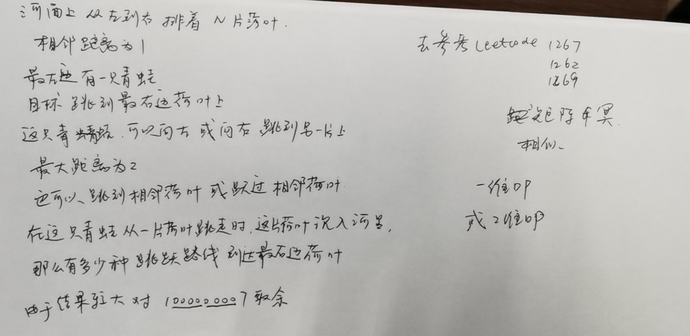

Title：[#403 青蛙过河](https://leetcode-cn.com/problems/frog-jump/)
# 问题描述
一只青蛙想要过河。 假定河流被等分为 x 个单元格，并且在每一个单元格内都有可能放有一石子（也有可能没有）。 青蛙可以跳上石头，但是不可以跳入水中。

给定石子的位置列表（用单元格序号升序表示）， 请判定青蛙能否成功过河（即能否在最后一步跳至最后一个石子上）。 开始时， 青蛙默认已站在第一个石子上，并可以假定它第一步只能跳跃一个单位（即只能从单元格1跳至单元格2）。

如果青蛙上一步跳跃了 k 个单位，那么它接下来的跳跃距离只能选择为 k - 1、k 或 k + 1个单位。 另请注意，青蛙只能向前方（终点的方向）跳跃。

请注意：

石子的数量 ≥ 2 且 < 1100；
每一个石子的位置序号都是一个非负整数，且其 < 231；
第一个石子的位置永远是0。

# 测试样例
示例 1:

[0,1,3,5,6,8,12,17]

总共有8个石子。
第一个石子处于序号为0的单元格的位置, 第二个石子处于序号为1的单元格的位置,
第三个石子在序号为3的单元格的位置， 以此定义整个数组...
最后一个石子处于序号为17的单元格的位置。

返回 true。即青蛙可以成功过河，按照如下方案跳跃： 
跳1个单位到第2块石子, 然后跳2个单位到第3块石子, 接着 
跳2个单位到第4块石子, 然后跳3个单位到第6块石子, 
跳4个单位到第7块石子, 最后，跳5个单位到第8个石子（即最后一块石子）。
示例 2:

[0,1,2,3,4,8,9,11]

返回 false。青蛙没有办法过河。 
这是因为第5和第6个石子之间的间距太大，没有可选的方案供青蛙跳跃过去。

# 解题方案
## 记忆化搜索，递归，二分查找
使用N * N的二维数组visit 来保存搜索记录，如visit[idx][k] 表示上一跳距离为k的第idx块石头是否已经计算访问过。使用了记忆化递归后的递归总次数为N * N（N个石头 和 K的最大值为N）
```c++
**
// solution 3: 记忆化递归 + 使用二分加快下一跳目标查找
class Solution {
public:
        vector<int> idx_diff = {-1, 0, 1};
        bool BackTracking(vector<int>& stones, int idx, int k, vector<vector<bool>>& visit) {
                if (idx == stones.size() - 1) return true;
                // pruning
                if (visit[idx][k]) return false;
                visit[idx][k] = true;

                for (auto &diff : idx_diff) {
                        int next_target = stones[idx] + k + diff;
                        auto first = std::lower_bound(stones.begin() + idx + 1, stones.end(), next_target);
                        if (first != stones.end() && *first == next_target) {
                                if (BackTracking(stones, first - stones.begin(), k+diff, visit)) return true;
                        }
                }
                return false;
        }

    bool canCross(vector<int>& stones) {
        int len = stones.size();
        vector<vector<bool>> visit(len, vector<bool>(len, false));                      // 表示是否已经计算过， 计算过的直接返回
        return BackTracking(stones, 0, 0, visit);
    }
};
```
时空复杂度：
time complexity O(N^2 * logN)
space complexity O(N^2)

## 动态规划
```c++
存在如下状态转移方程:
dp[i][k] = dp[j][k-1] || dp[j][k] || dp[j][k+1]      // 其中j取值范围为 0 ~ i-1
其中dp[i][k]表示下标为i的石头可否通过之前下标的石头跳k距离到达
class Solution {
public:
    bool canCross(vector<int>& stones) {
        int len = stones.size();
        vector<vector<bool>> dp(len, vector<bool>(len, false));
        dp[0][0] = true;

        for (int i = 1; i < len; ++i) {
                // pruning 1: 如果相邻两个石头i 与 i-1 之间的距离 比 第i-1号石头的最大跳跃范围i 还要大， 
                // 那么可以说对于下标i之前的任何石头都不可能可以跳到下标i及其之后石头了（即下标 >= i的石头都是不可达的），可以直接return 掉
                if (stones[i] - stones[i-1] > i) return false;
                for (int j = i-1; j >= 0; --j) {                // j从后往前， 方便剪枝
                        int k = stones[i] - stones[j];          // 直接计算可能的K值
                        if (k > j+1)    break;                  // 剪枝二: 如果下标j 不可能跳到下标i， 那么下标j之前的石头更加不可能可以跳到下标i的石头位置了，所以可以跳出该层循环
                        dp[i][k] = dp[j][k-1] | dp[j][k] | dp[j][k+1];
                }
        }
        return *(std::max_element(dp[len-1].begin(), dp[len-1].end()));
    }
};
```

# 补充
华为面试题目
