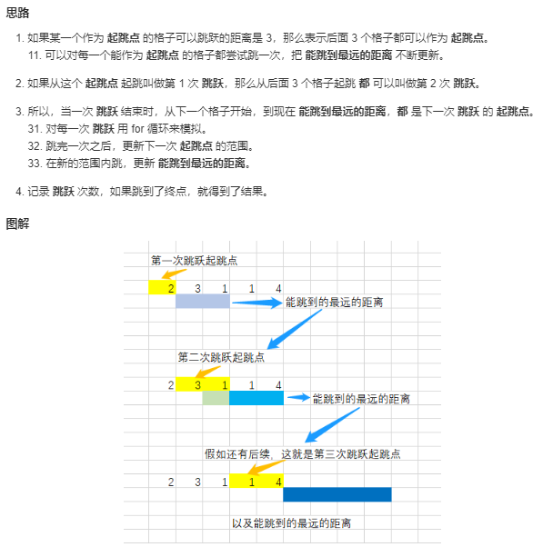

[# 45跳跃游戏](https://leetcode-cn.com/problems/jump-game-ii/)

<!-- @import "[TOC]" {cmd="toc" depthFrom=1 depthTo=6 orderedList=false} -->

<!-- code_chunk_output -->

- [题目描述](#题目描述)
- [测试样例](#测试样例)
- [解题思路](#解题思路)
  - [S1动态规划(超时)](#s1动态规划超时)
  - [S2动态规划贪心](#s2动态规划贪心)

<!-- /code_chunk_output -->

# 题目描述
给定一个非负整数数组，你最初位于数组的第一个位置。

数组中的每个元素代表你在该位置可以跳跃的最大长度。

你的目标是使用最少的跳跃次数到达数组的最后一个位置。

# 测试样例
示例:

输入: [2,3,1,1,4]
输出: 2
解释: 跳到最后一个位置的最小跳跃数是 2。
     从下标为 0 跳到下标为 1 的位置，跳 1 步，然后跳 3 步到达数组的最后一个位置。

说明:

假设你总是可以到达数组的最后一个位置。

# 解题思路
## S1动态规划(超时)
```c++
class Solution {
public:
    int jump(vector<int>& nums) {
        vector<int> res(nums.size()+1,INT_MAX);
        res[0]=0;
        for (int i=0;i<nums.size();i++)
        {   
            for(int j=1;j<nums[i]+1;j++)
            if(i+j<nums.size())
            res[i+j]=min(res[i+j],res[i]+1);
        }
        return res[nums.size()-1];
    }
};
```

## S2动态规划贪心

```C++
int jump(vector<int> &nums)
{
    int ans = 0;
    int start = 0;
    int end = 1;
    while (end < nums.size())
    {
        int maxPos = 0;
        for (int i = start; i < end; i++)
        {
            // 能跳到最远的距离
            maxPos = max(maxPos, i + nums[i]);
        }
        start = end;      // 下一次起跳点范围开始的格子
        end = maxPos + 1; // 下一次起跳点范围结束的格子
        ans++;            // 跳跃次数
    }
    return ans;
}
```