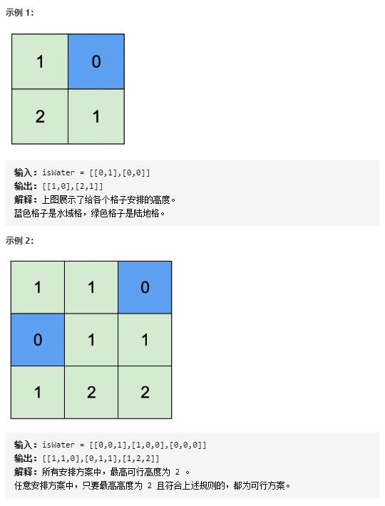

Title：[#5671. 地图中的最高点](https://leetcode-cn.com/problems/map-of-highest-peak/)
给你一个大小为 m x n 的整数矩阵 isWater ，它代表了一个由 陆地 和 水域 单元格组成的地图。

如果 isWater[i][j] == 0 ，格子 (i, j) 是一个 陆地 格子。
如果 isWater[i][j] == 1 ，格子 (i, j) 是一个 水域 格子。
你需要按照如下规则给每个单元格安排高度：

每个格子的高度都必须是非负的。
如果一个格子是是 水域 ，那么它的高度必须为 0 。
任意相邻的格子高度差 至多 为 1 。当两个格子在正东、南、西、北方向上相互紧挨着，就称它们为相邻的格子。（也就是说它们有一条公共边）
找到一种安排高度的方案，使得矩阵中的最高高度值 最大 。

请你返回一个大小为 m x n 的整数矩阵 height ，其中 height[i][j] 是格子 (i, j) 的高度。如果有多种解法，请返回 任意一个 



# 解题思路
## BFS
```C++
class Solution {
public:
    int dx[4] = {-1, 0, 1, 0};
    int dy[4] = {0, 1, 0, -1};
    vector<vector<int>> highestPeak(vector<vector<int>>& iswater) {
        int n = iswater.size(), m = iswater[0].size();
        vector<vector<int>> ans(n, vector<int>(m, -1));
        queue<pair<int, int>> q;
        for(int i = 0; i < n; ++i){
            for(int j = 0; j < m; ++j){
                if(iswater[i][j] == 1){
                    ans[i][j] = 0;
                    q.push({i, j});
                }
            }
        }
        int high = 0;
        while(q.size()){
            high++;
            int t = q.size();
            for(int i = 0; i < t; ++i){
                auto [x, y] = q.front(); q.pop();
                for(int dir = 0; dir < 4; ++dir){
                    int nx = x + dx[dir], ny = y + dy[dir];
                    if(0 <= nx && nx < n && 0 <= ny && ny < m && ans[nx][ny] == -1){
                        ans[nx][ny] = high;
                        q.push({nx, ny});
                    }
                }
            }
        }
        return ans;
    }
};
```

相似题目
[741.摘樱桃](https://leetcode-cn.com/problems/cherry-pickup/)
[1463.摘樱桃Ⅱ](https://leetcode-cn.com/problems/cherry-pickup-ii/)