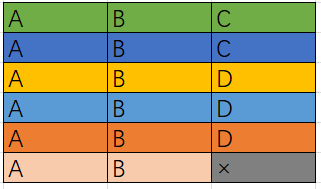

Title：[#621. 任务调度器](https://leetcode-cn.com/problems/task-scheduler/)

<!-- @import "[TOC]" {cmd="toc" depthFrom=1 depthTo=6 orderedList=false} -->

<!-- code_chunk_output -->

- [问题描述](#问题描述)
- [测试样例](#测试样例)
- [解题方案](#解题方案)
  - [S1:方法一 贪心算法](#s1方法一-贪心算法)
  - [S2:方法二 桶思想](#s2方法二-桶思想)
- [总结与拓展](#总结与拓展)

<!-- /code_chunk_output -->

# 问题描述
给定一个用字符数组表示的 CPU 需要执行的任务列表。其中包含使用大写的 A - Z 字母表示的26 种不同种类的任务。任务可以以任意顺序执行，并且每个任务都可以在 1 个单位时间内执行完。CPU 在任何一个单位时间内都可以执行一个任务，或者在待命状态。

然而，两个相同种类的任务之间必须有长度为 n 的冷却时间，因此至少有连续 n 个单位时间内 CPU 在执行不同的任务，或者在待命状态。

你需要计算完成所有任务所需要的最短时间。

# 测试样例
输入：tasks = ["A","A","A","B","B","B"], n = 2
输出：8
解释：A -> B -> (待命) -> A -> B -> (待命) -> A -> B.
     在本示例中，两个相同类型任务之间必须间隔长度为 n = 2 的冷却时间，而执行一个任务只需要一个单位时间，所以中间出现了（待命）状态。 

  
提示：

任务的总个数为 [1, 10000]。
n 的取值范围为 [0, 100]。
# 解题方案
## S1:方法一 贪心算法
此题同[#1054. 距离相等的条形码](https://leetcode-cn.com/problems/distant-barcodes/)，都可以采用贪心算法实现，即该题要使完成任务所需要的时间最短，即要把任务次数的数量多的先安排。假如有三种任务[A,A,A,A,B,B,C]，k=2。优先安排任务数多的，即有这样的执行顺序[A,B,C,A,B,待命，A，待命，待命，A]使得完成任务时间最少，为10。而其他执行顺序时间不可能比该中执行顺序下的时间短。

具体安排的方法可以这样设计：假如k=2时，我们规定3个任务为一轮，如上面的[A,B,C]为一轮，这样做的好处，可以保证一轮中不会出现同种任务被安排两次。满足了冷却时间这个要求。则我们一轮中可能出现两种选择：排序后，若任务数量够n+1种，则一轮中，把这所有的n+1个任务都选上。将这n+1中任务的数量减一。该轮的所需时间为n+1；或者，排序后，若任务数量不够n+1种，将所有的任务选上，被选上的任务数量减一。同时出现空闲时间，但该轮的所需时间仍为n+1。直到没有任务可选时，结束！当然，也可以采用优先队列(堆排序)完成该排序的功能。下面给出普通排序、堆排序(优先队列)两种实现！

代码：
```C++
//C++普通排序
class Solution {
public:

    static bool compare(pair<int,int>& pa, pair<int,int>& pb){
        return pa.second > pb.second;
    }
    
    int leastInterval(vector<char>& tasks, int n) {
        map<int,int> mp;
        // ans用来记录完成所有任务所需要的时间
        int ans = 0;
        for(int i=0;i<tasks.size();i++){
            mp[tasks[i]-'A']++;
        }
        vector<pair<int,int>> vc(mp.begin(), mp.end());
        sort(vc.begin(), vc.end() , compare);
        while(vc[0].second > 0){
            int i = 0;
            while(i <= n ){
                if(vc[0].second == 0) break;
                if(i < vc.size() && vc[i].second > 0) vc[i].second --;
                ans ++;
                i ++;
            }
            //一轮之后，需要重新排序
            sort(vc.begin(), vc.end(), compare);
        }
        return ans;
    }
};
```
```C++
//C++优先队列（堆排序）
class Solution {
public:

    int leastInterval(vector<char>& tasks, int n) {
        int ans = 0;
        unordered_map<int,int> mp;
        for(char c: tasks) mp[c] ++;
        priority_queue<int> pq;
        vector<int> vc;
        for(auto pr: mp){
            pq.push(pr.second);
        }
        while(!pq.empty()){
            int i = 0;
            vc.clear();
            while(i <= n){
                if(!pq.empty()){
                    int top = pq.top(); pq.pop();
                    if(top > 1){
                        top --;
                        vc.push_back(top);
                    } 
                }
                ans ++;
                if(pq.empty() && vc.empty()) break;
                i++;
            }
            for(int ele: vc) pq.push(ele);
        }
        return ans;
    }
};

```

## S2:方法二 桶思想
建立大小为n+1的桶子，个数为任务数量最多的那个任务，比如下图，等待时间n=2，A任务个数6个，我们建立6个桶子，每个容量为3：
我们可以把一个桶子看作一轮任务


1.先从最简单的情况看起，现在就算没有其他任务，我们完成任务A所需的时间应该是（6-1）*3+1=16，因为最后一个桶子，不存在等待时间。


2.接下来我们添加些其他任务

可以看到C其实并没有对总体时间产生影响，因为它被安排在了其他任务的冷却期间；
而B和A数量相同，这会导致最后一个桶子中，我们需要多执行一次B任务，现在我们需要的时间是（6-1）*3+2=17

前面两种情况，总结起来：总排队时间 = (桶个数 - 1) * (n + 1) + 最后一桶的任务数

3.当冷却时间短，任务种类很多时

比如上图，我们刚好排满了任务，此时所需时间还是17，如果现在我还要执行两次任务F，该怎么安排呢？

此时我们可以临时扩充某些桶子的大小，插进任务F，对比一下插入前后的任务执行情况：
插入前：ABC | ABC | ABD | ABD | ABD |AB
插入后：ABCF | ABCF | ABD | ABD | ABD |AB
我们在第一个、第二个桶子里插入了任务F，不难发现无论再继续插入多少任务，我们都可以类似处理，而且新插入元素肯定满足冷却要求
继续思考一下，这种情况下其实每个任务之间都不存在空余时间，冷却时间已经被完全填满了。
也就是说，我们执行任务所需的时间，就是任务的数量

这样剩下就很好处理了，我们只需要算两个数：
1.记录最大任务数量N，看一下任务数量并列最多的任务有多少个，即最后一个桶子的任务数X，计算NUM1=（N-1）*（n+1）+x
2.NUM2=tasks.size()
输出其中较大值即可
因为存在空闲时间时肯定是NUM1大，不存在空闲时间时肯定是NUM2>=NUM1

代码：
```C++
int leastInterval(vector<char>& tasks, int n) {
        int len=tasks.size();
        vector<int> vec(26);
        for(char c:tasks) ++vec[c-'A'];
        sort(vec.begin(),vec.end(),[](int& x,int&y){return x>y;});
        int cnt=1;
        while(cnt<vec.size()&&vec[cnt]==vec[0]) cnt++;
        return max(len,cnt+(n+1)*(vec[0]-1) );
    }
```

# 总结与拓展
