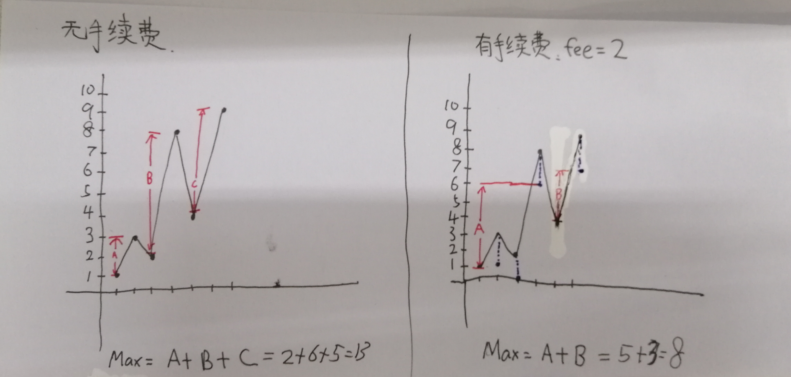

[#714.买卖股票的最佳时机含手续费](https://leetcode-cn.com/problems/best-time-to-buy-and-sell-stock-with-transaction-fee/)


<!-- @import "[TOC]" {cmd="toc" depthFrom=1 depthTo=6 orderedList=false} -->

<!-- code_chunk_output -->

- [问题描述](#问题描述)
- [测试样例](#测试样例)
- [解题方案](#解题方案)
  - [S1 动态规划](#s1-动态规划)
  - [S2 持仓、空仓状态机思想](#s2-持仓-空仓状态机思想)
  - [S3 动态规划](#s3-动态规划)

<!-- /code_chunk_output -->

# 问题描述
给定一个整数数组 prices，其中第 i 个元素代表了第 i 天的股票价格 ；非负整数 fee 代表了交易股票的手续费用。

你可以无限次地完成交易，但是你每笔交易都需要付手续费。如果你已经购买了一个股票，在卖出它之前你就不能再继续购买股票了。

返回获得利润的最大值。

注意：这里的一笔交易指买入持有并卖出股票的整个过程，每笔交易你只需要为支付一次手续费。

# 测试样例
示例 1:

输入: prices = [1, 3, 2, 8, 4, 9], fee = 2
输出: 8
解释: 能够达到的最大利润:  
在此处买入 prices[0] = 1
在此处卖出 prices[3] = 8
在此处买入 prices[4] = 4
在此处卖出 prices[5] = 9
总利润: ((8 - 1) - 2) + ((9 - 4) - 2) = 8.

注意:

0 < prices.length <= 50000.
0 < prices[i] < 50000.
0 <= fee < 50000.

# 解题方案
## S1 动态规划

没有手续费的题目做法：把一个个（峰 - 谷）加起来。
这题做法：跟上题类试，把一个个（（峰 - fee）- 谷）加起来。有手续费，要把峰降低（降低后才能看出是不是真的峰）。
下面模拟一下上帝视角买股票的真实心理过程，过程中差额累加和上面一模一样。
```C++
//因为上帝视角，每天的股票价都能看到，所以为了最优，我可以任性反悔
//第一种反悔：手里握着昨天，发现今天更低价，不要买昨天的，买入今天的
//第二种反悔：刚卖了昨天，发现今天更高价，不要昨天卖，今天再卖出
int maxProfit(vector<int>& prices, int fee) {
    if(prices.size()<2)
        return 0;
    int ans = 0;

    //第一天，买它，握在手里。
    int in_hand = prices[0];
    for(int i = 1;i < prices.size();i++)            
        //今天的比我手里的低价，第一种反悔
        if (prices[i] < in_hand)
            in_hand = prices[i];  
        //今天的减掉手续费后比我手里的高价，我要卖出！
        else if (prices[i] - fee > in_hand)
        {  
            //差额累加起来
            ans += (prices[i]-fee)- in_hand;
            //记录一下这天的卖出价，方便我决定1.买入明天的 或者 2.第二种反悔
            //明天比这个记录低就用上面那个if来进行买入明天的
            //明天比这个记录高，但减掉fee后比这个记录低，那么不能买入明天的，也不能第二种反悔。只能忽略，继续循环。
            //明天减掉fee后比这个记录高，通过这个记录来再累加差额一次达到第二种反悔的效果
            in_hand = prices[i]-fee;
        }                
    return ans;
}

```

## S2 持仓、空仓状态机思想
算法思路：
1）状态判断：首先根据题目特点容易知道要么持仓，要么空仓，持仓时只能等待卖出，空仓时只能等待买入；两个状态对立，可设置一个状态标记变量flag，当flag=0时，表示处于空仓待买入状态，flag=1时表示处于持仓待卖出状态。  
2）空仓状态下的行为：空仓状态下的关键任务或者行为是如何寻找买入点，显然当前prices[i]减去当前的最低点min后比交易成本大，说明买入是必然有利可图的，所以这是空仓状态下买入的唯一条件；另外min要时刻保持当前状态下的最低点，所以必须在prices[i] < min的条件下及时更新。  
3）持仓状态下的行为：持仓状态下的关键任务或者行为是如何寻找卖出点，显然当前卖出点s比prices[i]还大fee，说明在s处卖出可以获利，而且不影响后面的买入获利机会；另外在f未达到卖出条件时，要时刻保持当前卖出点s的更新，当prices[i] > s时，要更新。

代码
```C++
//C++
class Solution {
public:
    int maxProfit(vector<int>& prices, int fee) {
        int k=prices.size();
        if(k<2){
            return 0;
        }
        
        int sum=0;//当前利润
        int min=prices[0];//当前最低值
        int b;//记录买入点
        int s;//记录当前卖出点
        int flag=0;//状态标记，=1为当前处于持仓状态，待卖出；=0当前处于空仓状态，待买入
        for(int i=1;i<k;i++){//遍历prices数组
            if(!flag){//空仓状态：此状态下要寻找买入点或者更新最低点或者不作任何变化
                if(prices[i]-min>fee){//买入条件
                    flag=1;
                    b=min;
                    s=prices[i];
                    continue;//这一句不要漏掉
                }
                else if(prices[i]<min){//更新最低点条件
                    min=prices[i];
                }
            }
            if(flag){//持仓状态：此状态下要寻找卖出点或者更新卖出点或者不作任何变化
                if(s-prices[i]>fee){//卖出条件
                    flag=0;
                    sum+=s-b-fee;
                    min=prices[i];
                }
                else if(prices[i]>s){//更新卖出点条件
                    s=prices[i];
                }
            }
        }
        if(flag){
            sum+=s-b-fee;
        }
        return sum;
    }
};

```

## S3 动态规划
解题思路
1、设置dp：
dp[i][0] : 第i天，不持有股票时的收益
dp[i][1] : 第i天，持有股票时的收益
2、获取状态转移矩阵：
dp[i][1] = max(dp[i-1][1], dp[i-1][0] - nums[i] - fee)
dp[i][0] = max(dp[i-1][0], dp[i-1][1] + nums[i])
3、初始状态设定：
dp[0][0]: 表示第0天，不持有股票时的收益 == 0;
dp[0][1]: 表示第0天，持有股票的收益(不可能存在的现象：INT_MIN);
4、求解DP，返回值.

代码：
```c++
//c++
class Solution {
public:
    int maxProfit(vector<int>& prices, int fee) {
        if (prices.empty() || prices.size() == 0) {
            return 0;
        }
        vector<vector<int>> dp(prices.size()+1, vector<int>(2, 0));
        dp[0][0] = 0;
        dp[0][1] = INT_MIN;
        for (int i = 1; i < dp.size(); i++) {
            dp[i][0] = max(dp[i - 1][0], dp[i - 1][1] + prices[i - 1]);
            dp[i][1] = max(dp[i - 1][1], dp[i - 1][0] - prices[i - 1] - fee);
        }
        return dp[prices.size()][0];
    }
};

```