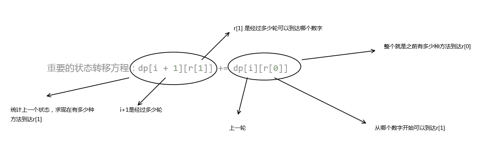

[LCP 07. 传递信息](https://leetcode-cn.com/problems/chuan-di-xin-xi/)
# 题目描述
小朋友 A 在和 ta 的小伙伴们玩传信息游戏，游戏规则如下：

有 n 名玩家，所有玩家编号分别为 0 ～ n-1，其中小朋友 A 的编号为 0
每个玩家都有固定的若干个可传信息的其他玩家（也可能没有）。传信息的关系是单向的（比如 A 可以向 B 传信息，但 B 不能向 A 传信息）。
每轮信息必须需要传递给另一个人，且信息可重复经过同一个人
给定总玩家数 n，以及按 [玩家编号,对应可传递玩家编号] 关系组成的二维数组 relation。返回信息从小 A (编号 0 ) 经过 k 轮传递到编号为 n-1 的小伙伴处的方案数；若不能到达，返回 0。

# 测试样例
示例 1：

输入：n = 5, relation = [ [0,2],[2,1],[3,4],[2,3],[1,4],[2,0],[0,4] ], k = 3

输出：3

解释：信息从小 A 编号 0 处开始，经 3 轮传递，到达编号 4。共有 3 种方案，分别是 0->2->0->4， 0->2->1->4， 0->2->3->4。

示例 2：

输入：n = 3, relation = [ [0,2],[2,1] ], k = 2

输出：0

解释：信息不能从小 A 处经过 2 轮传递到编号 2

限制：

2 <= n <= 10
1 <= k <= 5
1 <= relation.length <= 90, 且 relation[i].length == 2
0 <= relation[i][0],relation[i][1] < n 且 relation[i][0] != relation[i][1]

# 解题思路
## S1 动态规划
从0开始，经过第一轮可以到达的数字的次数是...
从0开始，经过第二轮可以到达的数字的次数是...
从0开始，经过第三轮可以到达的数字...

```c++
class Solution {
public:
    int numWays(int n, vector<vector<int>>& relation, int k) {
        int dp[10][15];
        memset(dp, 0, sizeof(dp));
        dp[0][0] = 1;
        for(int i = 0; i < k; i++)
            for(auto r : relation)
                dp[i + 1][r[1]] += dp[i][r[0]];
        return dp[k][n - 1];
    }
};
```
## S2 dfs
```c++
class Solution {
public:
    int ans = 0;
    int numWays(int n, vector<vector<int>>& relation, int k) {
        vector<vector<int>> v(n);
        for (auto r : relation)
            v[r[0]].push_back(r[1]);
        dfs(n - 1, v, k, 0, 0); 
        return ans;
    }

    void dfs(int n, vector<vector<int>> v, int dis, int deep, int pos) {
        if (deep == dis) {
            if (pos == n) ++ans;
            return;
        }

        for (int topos : v[pos])
            dfs(n, v, dis, deep + 1, topos);
        return;
    }
};
```