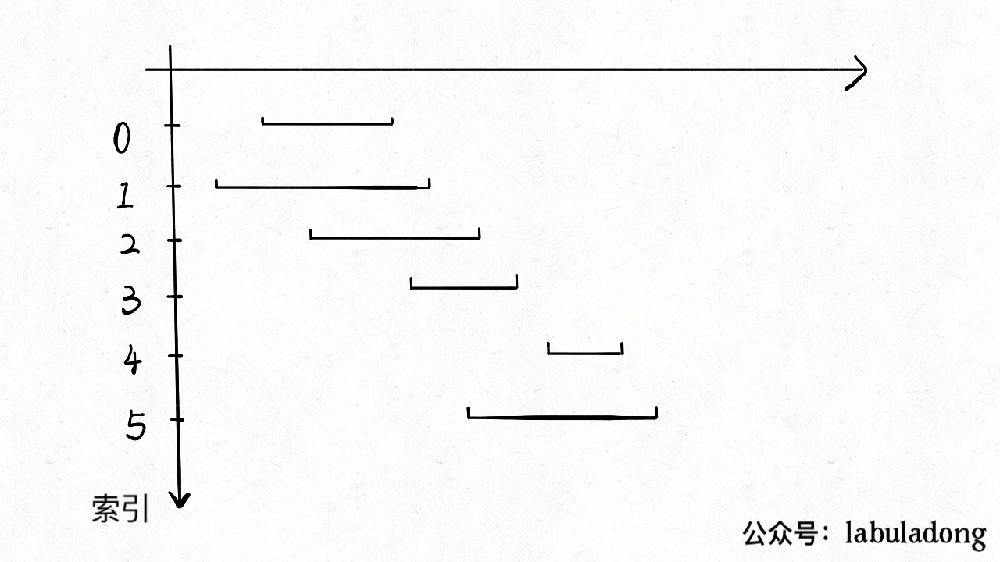
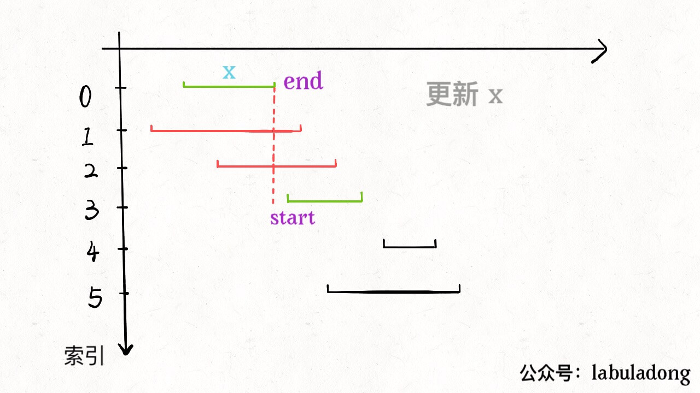

# 动态规划
具体来说，动态规划的一般流程就是三步：暴力的递归解法 -> 带备忘录的递归解法 -> 迭代的动态规划解法。
就思考流程来说，就分为一下几步：找到状态和选择 -> 明确 dp 数组/函数的定义 -> 寻找状态之间的关系。

## [股票买卖问题](https://github.com/labuladong/fucking-algorithm/blob/master/%E5%8A%A8%E6%80%81%E8%A7%84%E5%88%92%E7%B3%BB%E5%88%97/%E5%9B%A2%E7%81%AD%E8%82%A1%E7%A5%A8%E9%97%AE%E9%A2%98.md)
买卖一次：[121.买卖股票的最佳时机](https://leetcode-cn.com/problems/best-time-to-buy-and-sell-stock/)
买卖多次：[121.买卖股票的最佳时机 II](https://leetcode-cn.com/problems/best-time-to-buy-and-sell-stock-ii/)
买卖两笔：[123. 买卖股票的最佳时机 III](https://leetcode-cn.com/problems/best-time-to-buy-and-sell-stock-iii/)
买卖K笔: [188. 买卖股票的最佳时机 IV](https://leetcode-cn.com/problems/best-time-to-buy-and-sell-stock-iv/)
买卖多次，付手续费：[714. 买卖股票的最佳时机含手续费](https://leetcode-cn.com/problems/best-time-to-buy-and-sell-stock-with-transaction-fee/)
买卖多次有冷冻期: [309. 最佳买卖股票时机含冷冻期](https://leetcode-cn.com/problems/best-time-to-buy-and-sell-stock-with-cooldown/)

## 石子游戏
一次一堆：[877. 石子游戏](https://leetcode-cn.com/problems/stone-game/)
一次1到2M堆：[1140. 石子游戏 II](https://leetcode-cn.com/problems/stone-game-ii/)
一次1、2、3堆：[1406. 石子游戏 III](https://leetcode-cn.com/problems/stone-game-iii/)
一堆拿非零平方数石子：[1510. 石子游戏 IV](https://leetcode-cn.com/problems/stone-game-iv/)

## [打家劫舍](https://github.com/labuladong/fucking-algorithm/blob/master/%E5%8A%A8%E6%80%81%E8%A7%84%E5%88%92%E7%B3%BB%E5%88%97/%E6%8A%A2%E6%88%BF%E5%AD%90.md)
一排不能偷相邻的:[198. 打家劫舍](https://leetcode-cn.com/problems/house-robber/)
一圈不能偷相邻的：[213. 打家劫舍 II](https://leetcode-cn.com/problems/house-robber-ii/)
二叉树结构：[337. 打家劫舍 III](https://leetcode-cn.com/problems/house-robber-iii/)


## [经典动态规划问题：高楼扔鸡蛋](https://leetcode-cn.com/problems/super-egg-drop/)
### 题目描述
你将获得 K 个鸡蛋，并可以使用一栋从 1 到 N  共有 N 层楼的建筑。

每个蛋的功能都是一样的，如果一个蛋碎了，你就不能再把它掉下去。

你知道存在楼层 F ，满足 0 <= F <= N 任何从高于 F 的楼层落下的鸡蛋都会碎，从 F 楼层或比它低的楼层落下的鸡蛋都不会破。

每次移动，你可以取一个鸡蛋（如果你有完整的鸡蛋）并把它从任一楼层 X 扔下（满足 1 <= X <= N）。

你的目标是确切地知道 F 的值是多少。

无论 F 的初始值如何，你确定 F 的值的最小移动次数是多少？
### 思路分析
对动态规划问题，直接套我们以前多次强调的框架即可：这个问题有什么「状态」，有什么「选择」，然后穷举。
「状态」很明显，就是当前拥有的鸡蛋数 K 和需要测试的楼层数 N。随着测试的进行，鸡蛋个数可能减少，楼层的搜索范围会减小，这就是状态的变化。
「选择」其实就是去选择哪层楼扔鸡蛋。回顾刚才的线性扫描和二分思路，二分查找每次选择到楼层区间的中间去扔鸡蛋，而线性扫描选择一层层向上测试。不同的选择会造成状态的转移。
现在明确了「状态」和「选择」，动态规划的基本思路就形成了：肯定是个二维的 dp 数组或者带有两个状态参数的 dp 函数来表示状态转移；外加一个 for 循环来遍历所有选择，择最优的选择更新状态：
我们选择在第 i 层楼扔了鸡蛋之后，可能出现两种情况：鸡蛋碎了，鸡蛋没碎。注意，这时候状态转移就来了：
如果鸡蛋碎了，那么鸡蛋的个数 K 应该减一，搜索的楼层区间应该从 [1..N] 变为 [1..i-1] 共 i-1 层楼；
如果鸡蛋没碎，那么鸡蛋的个数 K 不变，搜索的楼层区间应该从 [1..N] 变为 [i+1..N] 共 N-i 层楼。
```c++
class Solution {
public:
    int superEggDrop(int K, int N) {
        if(K == 0 || N == 0) return 0;
        if(K == 1) return N;
        if(N == 1) return 1;
        int minDrop = N + 1;
        for(int x = 1; x <= N; x ++){
            minDrop = min(minDrop, max(superEggDrop(K, N-x), superEggDrop(K-1, x-1)) + 1);
        }
        return minDrop;
    }
};
```
此处需要一个备忘录，进行剪枝处理
```c++
class Solution {
public:
    int superEggDrop(int K, int N) {
        int eggNum = K, floorNum = N;
        if(eggNum < 1 || floorNum < 1)
            return 0;
        //备忘录，存储eggNum个鸡蛋，floorNum层楼条件下的最优化尝试次数
        vector<vector<int>> cache(eggNum + 1, vector<int>(floorNum + 1, 0));
        //把备忘录每个元素初始化成最大的尝试次数
        for(int i = 1; i <= eggNum; i ++){
            for(int j = 1; j <= floorNum; j ++)
                cache[i][j] = j;
        }
        for(int n = 2; n <= eggNum; n ++){
            for (int m = 1; m <= floorNum; m ++){
                for(int k = 1; k < m; k ++){
                    //扔鸡蛋的楼层从1到m枚举一遍，如果当前算出的尝试次数小于上一次的尝试次数
                    cache[n][m] = min(cache[n][m], max(cache[n - 1][k - 1], cache[n][m - k]) + 1);
                }
            }
        }
        return cache[eggNum][floorNum];
    }
};
```
二分查找优化
```c++
class Solution {
    unordered_map<int, int> memo;
    int dp(int K, int N) {
        if (memo.find(N * 100 + K) == memo.end()) {
            int ans;
            if (N == 0) ans = 0;
            else if (K == 1) ans = N;
            else {
                int lo = 1, hi = N;
                while (lo + 1 < hi) {
                    int x = (lo + hi) / 2;
                    int t1 = dp(K-1, x-1);
                    int t2 = dp(K, N-x);

                    if (t1 < t2) lo = x;
                    else if (t1 > t2) hi = x;
                    else lo = hi = x;
                }

                ans = 1 + min(max(dp(K-1, lo-1), dp(K, N-lo)),
                                   max(dp(K-1, hi-1), dp(K, N-hi)));
            }

            memo[N * 100 + K] = ans;
        }

        return memo[N * 100 + K];
    }
public:
    int superEggDrop(int K, int N) {
        return dp(K, N);
    }
};
```
## 贪心算法之区间调度问题
### 问题描述
一个很经典的贪心算法问题 Interval Scheduling（区间调度问题）。给你很多形如 [start, end] 的闭区间，请你设计一个算法，算出这些区间中最多有几个互不相交的区间。
举个例子，intvs = [ [1,3], [2,4], [3,6] ]，这些区间最多有 2 个区间互不相交，即 [ [1,3], [3,6] ]，你的算法应该返回 2。注意边界相同并不算相交。
这个问题在生活中的应用广泛，比如你今天有好几个活动，每个活动都可以用区间 [start, end] 表示开始和结束的时间，请问你今天最多能参加几个活动呢？显然你一个人不能同时参加两个活动，所以说这个问题就是求这些时间区间的最大不相交子集。
### 思路分析
这个问题有许多看起来不错的贪心思路，却都不能得到正确答案。比如说：
也许我们可以每次选择可选区间中开始最早的那个？但是可能存在某些区间开始很早，但是很长，使得我们错误地错过了一些短的区间。或者我们每次选择可选区间中最短的那个？或者选择出现冲突最少的那个区间？这些方案都能很容易举出反例，不是正确的方案。
正确的思路其实很简单，可以分为以下三步：
1、从区间集合 intvs 中选择一个区间 x，这个 x 是在当前所有区间中结束最早的（end 最小）。
2、把所有与 x 区间相交的区间从区间集合 intvs 中删除。
3、重复步骤 1 和 2，直到 intvs 为空为止。之前选出的那些 x 就是最大不相交子集。
把这个思路实现成算法的话，可以按每个区间的 end 数值升序排序，因为这样处理之后实现步骤 1 和步骤 2 都方便很多:

现在来实现算法，对于步骤 1，由于我们预先按照 end 排了序，所以选择 x 是很容易的。关键在于，如何去除与 x 相交的区间，选择下一轮循环的 x 呢？
由于我们事先排了序，不难发现所有与 x 相交的区间必然会与 x 的 end 相交；如果一个区间不想与 x 的 end 相交，它的 start 必须要大于（或等于）x 的 end：

### 例题
[435. 无重叠区间](https://leetcode-cn.com/problems/non-overlapping-intervals/)
[题解](https://leetcode-cn.com/problems/non-overlapping-intervals/solution/ctan-xin-suan-fa-by-liu-wen-tao-2/)
[452. 用最少数量的箭引爆气球](https://leetcode-cn.com/problems/minimum-number-of-arrows-to-burst-balloons/)
[题解](https://leetcode-cn.com/problems/minimum-number-of-arrows-to-burst-balloons/solution/yong-zui-shao-shu-liang-de-jian-yin-bao-qi-qiu-b-2/)
[312.戳气球](https://leetcode-cn.com/problems/burst-balloons/)
[题解](https://leetcode-cn.com/problems/burst-balloons/solution/c-dong-tai-gui-hua-qu-jian-dp-mo-ban-ti-by-wilson7/)