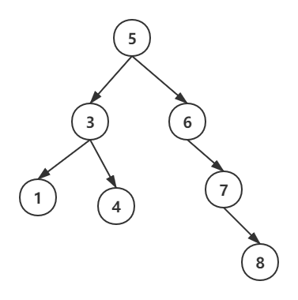

# 二叉搜索树
二叉搜索树的定义：对于树中的所有子树都有，左子树上的值都小于根节点的值，右子树上的值都大于根节点上的值。总结一下就是，树的中序遍历可以得到一个升序序列。

## 最小二叉树的高度
[#面试题 04.02. 最小高度树](https://leetcode-cn.com/problems/minimum-height-tree-lcci/)
那如何保证高度最小呢？当树中的任意结点的左右子树高度差都不超过 1 时，整棵树的深度最小。

下面是一种构造最小高度树的思路：

如果序列长度为 0，那么是一棵空树。
如果序列长度为 1，那么只有一个根节点。
如果长度大于 1，那么选取中间位置的数赋给根节点，然后前一半递归构建左子树，后一半递归构建右子树。
以 [-5,-3,0,1,5,9] 为例，构造过程如下图所示：


代码
```c++
/**
 * Definition for a binary tree node.
 * struct TreeNode {
 *     int val;
 *     TreeNode *left;
 *     TreeNode *right;
 *     TreeNode(int x) : val(x), left(NULL), right(NULL) {}
 * };
 */
class Solution {
public:
    TreeNode* dfs(const vector<int> &nums, int L, int R) {
        if(L > R) {
            return nullptr;
        }
        int mid = (L+R)>>1;
        auto ptr = new TreeNode(nums[mid]); //填充根节点
        ptr->left = dfs(nums, L, mid-1); //构造左子树
        ptr->right = dfs(nums, mid+1, R); //构造右子树
        return ptr;
    }
    TreeNode* sortedArrayToBST(vector<int>& nums) {
        return dfs(nums, 0, nums.size()-1);
    }
};
```
## 二叉树的深度
[#面试题55 - I. 二叉树的深度](https://leetcode-cn.com/problems/er-cha-shu-de-shen-du-lcof/)
使用DFS
```c++
/**
 * Definition for a binary tree node.
 * struct TreeNode {
 *     int val;
 *     TreeNode *left;
 *     TreeNode *right;
 *     TreeNode(int x) : val(x), left(NULL), right(NULL) {}
 * };
 */
class Solution {
public:
    int maxDepth(TreeNode* root) {
        if(root == NULL) return 0;
        return max(maxDepth(root->left), maxDepth(root->right)) + 1;
    }
};
```
使用BFS
```C++
class Solution {
public:
    int maxDepth(TreeNode* root) {
        queue<TreeNode*> q;
        if (root) q.push(root);
        int ans = 0;
        while (!q.empty()) {
            for (int i = q.size() - 1; i >= 0; --i) {
                TreeNode* cur = q.front();
                q.pop();
                if (cur->left) q.push(cur->left);
                if (cur->right) q.push(cur->right);
            }
            ++ans;
        }
        return ans;
    }
};
```
使用队列进行层次遍历
使用队列进行层次遍历利用的就是队列先进先出的特点，使得每一层的元素一定相邻
比如：
```
    3
   / \
  9  20
    /  \
   15   7
```
先入队 3，队列 [3]

然后 3 出队，入队 3 的左右结点 9 20，队列 [9 20]

然后 9 出队，入队 9 的左右结点，没有就跳过，队列 [20]

然后 20 出队，入队 20 的左右结点 15 7，队列 [15 7]

所以每一层操作完之后队列就变成了下一层的元素。

所以可以保证 q.size() 就是当前层的元素的数目。

那么每层操作完层数加一即可。

```c++
/**
 * Definition for a binary tree node.
 * struct TreeNode {
 *     int val;
 *     TreeNode *left;
 *     TreeNode *right;
 *     TreeNode(int x) : val(x), left(NULL), right(NULL) {}
 * };
 */
class Solution {
public:
    int maxDepth(TreeNode* root) {
        if(root == NULL) return 0;
        queue<TreeNode*> q;
        int ans = 0;
        q.push(root);
        while(!q.empty()){
            int size = q.size();
            for (int i = 0; i < size; i ++) {
                TreeNode* node = q.front(); 
                q.pop();
                if (node->left) q.push(node->left);
                if (node->right) q.push(node->right);
            }
            ans ++;
        }
        return ans;
    }
};
```
## 二叉树的镜像
[面试题27. 二叉树的镜像](https://leetcode-cn.com/problems/er-cha-shu-de-jing-xiang-lcof/)
请完成一个函数，输入一个二叉树，该函数输出它的镜像。
```
例如输入：
     4
   /   \
  2     7
 / \   / \
1   3 6   9

镜像输出：

     4
   /   \
  7     2
 / \   / \
9   6 3   1

```
递归
·模型：二叉树的先序遍历（遍历二叉树的所有结点）
·递归返回条件：当前结点为 NULL
·实现操作：交换根结点的左右子树
```c++
class Solution {
public:
    TreeNode* mirrorTree(TreeNode* root) {
        if (root == NULL) {
            return NULL;
        }
        swap(root->left, root->right);
        mirrorTree(root->left);
        mirrorTree(root->right);
        return root;
    }
};
```
栈模拟
·模型：栈模拟二叉树的先序遍历
·循环结束条件：栈为空
·实现操作：交换栈顶结点的左右子树
```c++
class Solution {
public:
    TreeNode* mirrorTree(TreeNode* root) {
        stack<TreeNode*> s;
        s.push(root);
        while (!s.empty()) {
            TreeNode* node = s.top();
            s.pop();
            if (node == NULL) {
                continue;
            }
            swap(node->left, node->right);
            s.push(node->left); 
            s.push(node->right);
        }
        return root;
    }
};
```
队列模拟
·模型：使用队列模拟二叉树的层次遍历
·循环结束条件：队列为空
·实现操作：交换队首结点的左右子树
```c++
class Solution {
public:
    TreeNode* mirrorTree(TreeNode* root) {
        queue<TreeNode*> q;
        q.push(root);
        while (!q.empty()) {
            TreeNode* node = q.front();
            q.pop();
            if (node == NULL) {
                continue;
            }
            swap(node->left, node->right);
            q.push(node->left);
            q.push(node->right);
        }
        return root;
    }
};
```
## 二叉搜索树的范围和
[二叉搜索树的范围和](https://leetcode-cn.com/problems/range-sum-of-bst/)
给定二叉搜索树的根结点 root，返回 L 和 R（含）之间的所有结点的值的和。

递归
```c++
/**
 * Definition for a binary tree node.
 * struct TreeNode {
 *     int val;
 *     TreeNode *left;
 *     TreeNode *right;
 *     TreeNode(int x) : val(x), left(NULL), right(NULL) {}
 * };
 */
class Solution {
public:
   
    int rangeSumBST(TreeNode* root, int L, int R) {
        if(!root) return 0;//若树为空返回0
        if(root->val>R)//若根节点比R还大 那只到根节点的左子树中找
            return rangeSumBST(root->left,L,R);
        else if(root->val < L){//若根节点比L小，那自从根节点的又子树找
            return rangeSumBST(root->right,L,R);
        }

        else//若根节点在L与R之间 加上根节点的值 再到左右子树中找
            return root->val+rangeSumBST(root->left,L,R)+rangeSumBST(root->right,L,R);
 


    }
};
```

## 合并二叉树
[合并二叉树](https://leetcode-cn.com/problems/merge-two-binary-trees/)
给定两个二叉树，想象当你将它们中的一个覆盖到另一个上时，两个二叉树的一些节点便会重叠。

你需要将他们合并为一个新的二叉树。合并的规则是如果两个节点重叠，那么将他们的值相加作为节点合并后的新值，否则不为 NULL 的节点将直接作为新二叉树的节点。
```
示例
输入: 
	Tree 1                     Tree 2                  
          1                         2                             
         / \                       / \                            
        3   2                     1   3                        
       /                           \   \                      
      5                             4   7                  
输出: 
合并后的树:
	     3
	    / \
	   4   5
	  / \   \ 
	 5   4   7
```
```c++

class Solution {
public:
    TreeNode* mergeTrees(TreeNode* t1, TreeNode* t2) {
        
        if (t1 == nullptr)
        {
            return t2;
        }

        if (t2 == nullptr)
        {
            return t1;
        }

        t1->val += t2->val;

        t1->left = mergeTrees(t1->left, t2->left);

        t1->right = mergeTrees(t1->right, t2->right);

        return t1;
    }
};
```

## 路径总和
[路经总和](https://leetcode-cn.com/problems/path-sum-iii/)
给定一个二叉树，它的每个结点都存放着一个整数值。找出路径和等于给定数值的路径总数。路径不需要从根节点开始，也不需要在叶子节点结束，但是路径方向必须是向下的（只能从父节点到子节点）。

双递归
```c++
/**
 * Definition for a binary tree node.
 * struct TreeNode {
 *     int val;
 *     TreeNode *left;
 *     TreeNode *right;
 *     TreeNode(int x) : val(x), left(NULL), right(NULL) {}
 * };
 */
class Solution {
public:
    int helper(TreeNode* root, int sum) {
        if (root== NULL) return 0;
        sum -= root->val;
        return (sum==0?1:0) + helper(root->left, sum) + helper(root->right, sum);
    }
    int pathSum(TreeNode* root, int sum) {
        if (root == NULL) return 0;
        return helper(root, sum)+pathSum(root->left, sum)+pathSum(root->right, sum);
    }
};
```
map、前缀和、递归
```
思路
对树使用前缀和
使用 unordered_map 对树进行记录
对 unordered_map 回溯
```
```c++
class Solution {
public:
    void dfs(TreeNode* root, int ps, int sum, unordered_map<int, int>& vi, int& ans) {
        if (root == nullptr) return;
        root->val += ps;
        ans += vi[root->val - sum];
        vi[root->val]++;
        dfs(root->left, root->val, sum, vi, ans);
        dfs(root->right, root->val, sum, vi, ans);
        vi[root->val]--;
    }

    int pathSum(TreeNode* root, int sum) {
        int ans = 0;
        unordered_map<int, int> vi;
        vi[0] = 1;
        dfs(root, 0, sum, vi, ans);
        return ans;
    }
};
```
