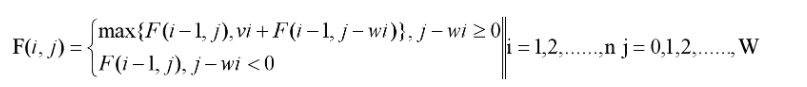
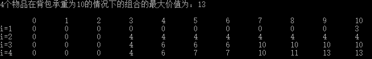
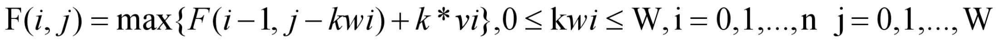
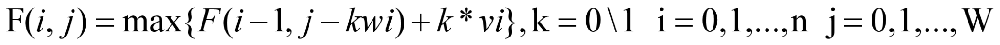
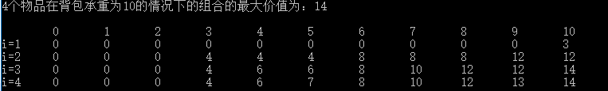

# 背包问题
## 01背包
问题描述：给定n个物体（它们的重量为：w1，w2，......，wn，价值为：v1，v2，......，vn） 和 一个承受重量为W的背包，问怎么选取这些物体，放在背包中（不超过背包的承重），让所取的子集达到最大价值。
### 基本实现
首先，我们很自然想到穷举法，只要给出n个物体的所有组合（子集），分别各个子集的总价值，去掉那些总重量超过背包承重W的子集之后，对剩下的子集中找到总价值最大的那一个，就是我们想要的结果了。

但是，由于n各物体的有$2^n$个子集，所以上面的做法的时间复杂度将是$O(2^n)$，除非n很小，否则时间性能消耗非常严重。

我们换一种思路，如果物体有n-1个，在背包容量为0,1,2，......，W各个情况下所能得到的最大价值都已经知道，那么当我们多考虑一个物体，即物体有n个时，就可以分为两个情况进行考虑：（1）第n个物体不放进背包中；（2）第n个物体放进背包。

对于第一种情况，考虑n个物体，跟考虑n-1个物体没有区别，所以考虑n个物体的情况下，在一定承重量的背包中所能得到的最大价值等于只考虑n-1个物体在同等承重量的背包下所能得到的最大价值。

对于第二种情况，则最大价值 = 物体n的价值vn + 背包在剩余空间（W-wn）下只考虑n-1个物体所能达到的最大价值。

其中，F(i,j)表示前 i 个物体(1≤ i ≤n）在背包承重为 j 时，所能达到的最大价值。如果把它看成一个状态的话，那么也就是说，状态F(i,j)的值等于状态F(i-1,j)、状态F(i-1,j-wi)与vi之和 两者中的最大值。那么要求 i 个物体在一定承重背包中可取的最大价值，只需考虑 i-1 个物体在不同承重量（0，1， 2， ......，W）的背包下可取的最大价值。类似地，要想知道 i-1 个物体在一定承重的背包中可取的最大价值，只需知道 i-2 个物体在不同承重量的背包中可取的最大价值。以此类推，直到所考虑的物体个数变为 1 。

所以，只要我们知道物体个数为 1 时，在不同承重量的背包中所能取到的最大价值，就可以依次求物体个数为2,3，......，n的情况下在不同承重量的背包中所能取的最大价值。
### 代码
```c++
void main()
{
		vector<int> w = { 0,10,3,4,5 };//weight是每个物体的重量
		vector<int> v = { 0,3,4,6,7 };//value是每个物体的价值
		int m = 10;//背包承重
		int n = 4;//物体的种类
		vector<vector<int>> maxValue(5, vector<int>(11));
			for (int i = 1; i <= n; i++)//第一个物体是第一行
			{
				for (int j = 0; j <=m; j++)
				{
					if (i > 1)
					{
						maxValue[i][j] = maxValue[i - 1][j];//不装第i类物体的情况
							if(j >= w[i]){
							maxValue[i][j] = max(maxValue[i][j], maxValue[i - 1][j - w[i]] + v[i]);
				}
					}
					else { //初始化，只考虑一个物体
						if (j >= w[1]) {
							maxValue[1][j] = v[1];
						}
					}
				}
			}
		printf("4个物品在背包承重为10的情况下的组合的最大价值为%d\n",maxValue[n][m]);

		// 打印背包的不同承重量
		printf("i=0\t");
		for (int i = 0; i <= m; i++) {
			printf("%d\t",i);
		}
		printf("\n");
		// 打印01背包算法 得到的状态矩阵值
		for (int i = 1; i <= n; i++) {
			printf("i=%d\t",i);
			for (int j = 0; j <= m; j++) {
				printf("%d\t",maxValue[i][j]);
			}
			printf("\n");
		}
		return ;
}
````
打印图


## 完全背包
问题描述：完全背包是在01背包的基础上加了个条件：这n种物品都有无限的数量可以取，问怎样拿才可以实现价值最大化。
### 基本实现
虽然题意中每种有无限件，但这里有个隐藏条件：背包承重量的固定性导致每种最多只能取某个值，再多就放不下了，这个值就是W / wi。也就是说，对于第 i 种物品，它可以取0,1,2，......，W / wi（向下取整）件。而在01背包中，对于第 i 种物品，只能取0,1件。我们可以看到，01背包其实就是完全背包的一个特例。所以我们可以用类似01背包的思路写出完全背包的基本算法。

对比之下，之前01背包的状态转移方程可以写成

### 代码
```c++
void main()
{
		vector<int> w = { 0,10,3,4,5 };//weight是每个物体的重量
		vector<int> v = { 0,3,4,6,7 };//value是每个物体的价值
		int m = 10;//背包承重
		int n = 4;//物体的种类
		vector<vector<int>> maxValue(5, vector<int>(11));
			for (int i = 1; i <= n; i++)//第一个物体是第一行
			{
				for (int j = 0; j <=m; j++)
				{
					if (i > 1)
					{
						maxValue[i][j] = maxValue[i - 1][j];//不装第i类物体的情况
							if(j >= w[i]){
								int maxTmp = 0;
								// 对于i个物品，进行j/w[i]次比较得到最大值；而01背包中只需要进行1次比较
                                for (int k = 1; k <= j / w[i]; k++) {
									if (maxValue[i - 1][j - k * w[i]] + k * v[i] > maxTmp) {
										maxTmp = maxValue[i - 1][j - k * w[i]] + k * v[i];
									}
								}
							maxValue[i][j] = max(maxValue[i][j], maxTmp);
				}
					}
					else { //初始化，只考虑一个物体
						if (j >= w[1]) {
							maxValue[1][j] = j / w[1] * v[1];
						}
					}
				}
			}
		printf("4个物品在背包承重为10的情况下的组合的最大价值为%d\n",maxValue[n][m]);

		// 打印背包的不同承重量
		printf("i=0\t");
		for (int i = 0; i <= m; i++) {
			printf("%d\t",i);
		}
		printf("\n");
		// 打印01背包算法 得到的状态矩阵值
		for (int i = 1; i <= n; i++) {
			printf("i=%d\t",i);
			for (int j = 0; j <= m; j++) {
				printf("%d\t",maxValue[i][j]);
			}
			printf("\n");
		}
		return ;
}
````
打印图


## 多重背包
问题描述：多重背包是在01背包的基础上，加了个条件：第 i 件物品有mount[i]件
### 基本实现
完全背包的基本实现思路也可以应用到多重背包的基本实现。对于多重背包的基本实现，与完全背包是基本一样的，不同就在于物品的个数上界不再是m/weight[i]而是mount[i]与m/weight[i]中较小的那个。所以我们要在完全背包的基本实现之上，再考虑这个上界问题。
f[i][j] = max{f[i-1][j-k*weight[i]] + k*value[i]} ,其中(0 <= k <= min{m/weight[i], mount[i]})
### 代码
```c++
void main()
{
		vector<int> w = { 0,10,3,4,5 };//weight是每个物体的重量
		vector<int> v = { 0,3,4,6,7 };//value是每个物体的价值	
		vector<int> mount = { 0,5,1,2,1 };//第i个物品对应的个数
		int m = 10;//背包承重
		int n = 4;//物体的种类
		vector<vector<int>> maxValue(5, vector<int>(11));
			for (int i = 1; i <= n; i++)//第一个物体是第一行
			{
				for (int j = 0; j <=m; j++)
				{
					if (i > 1)
					{
						maxValue[i][j] = maxValue[i - 1][j];//不装第i类物体的情况
							if(j >= w[i]){
								int maxTmp = 0;
								//多重背包与完全背包的区别只在内循环这里
								for (int k = 1; k <= j / w[i] && k <= mount[i]; k++) {
									if (maxValue[i - 1][j - k * w[i]] + k * v[i] > maxTmp) {
										maxTmp = maxValue[i - 1][j - k * w[i]] + k * v[i];
									}
								}
							maxValue[i][j] = max(maxValue[i][j], maxTmp);
				}
					}
					else { //初始化，只考虑一个物体
						if (j >= w[1]) {
							maxValue[1][j] = j / w[1] * v[1];
						}
					}
				}
			}
		printf("4个物品在背包承重为10的情况下的组合的最大价值为%d\n",maxValue[n][m]);

		// 打印背包的不同承重量
		printf("i=0\t");
		for (int i = 0; i <= m; i++) {
			printf("%d\t",i);
		}
		printf("\n");
		// 打印01背包算法 得到的状态矩阵值
		for (int i = 1; i <= n; i++) {
			printf("i=%d\t",i);
			for (int j = 0; j <= m; j++) {
				printf("%d\t",maxValue[i][j]);
			}
			printf("\n");
		}
		return ;
}
```