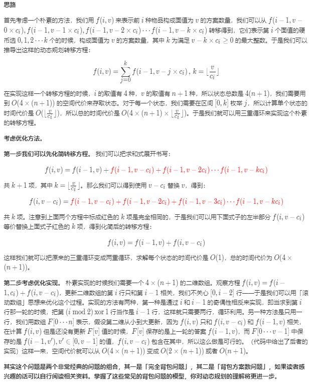
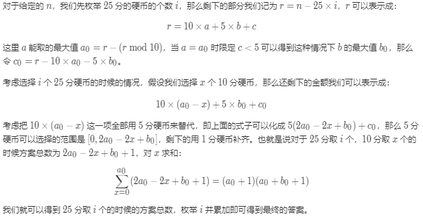

[面试题 08.11. 硬币](https://leetcode-cn.com/problems/coin-lcci/)


<!-- @import "[TOC]" {cmd="toc" depthFrom=1 depthTo=6 orderedList=false} -->

<!-- code_chunk_output -->

- [问题描述](#问题描述)
- [测试样例](#测试样例)
- [解题方案](#解题方案)
  - [S1.动态规划](#s1动态规划)
  - [S2.数学](#s2数学)
- [总结与拓展](#总结与拓展)

<!-- /code_chunk_output -->

# 问题描述
硬币。给定数量不限的硬币，币值为25分、10分、5分和1分，编写代码计算n分有几种表示法。(结果可能会很大，你需要将结果模上1000000007)

# 测试样例

示例1:

 输入: n = 5
 输出：2
 解释: 有两种方式可以凑成总金额:
5=5
5=1+1+1+1+1
示例2:

 输入: n = 10
 输出：4
 解释: 有四种方式可以凑成总金额:
10=10
10=5+5
10=5+1+1+1+1+1
10=1+1+1+1+1+1+1+1+1+1
说明：

注意:

你可以假设：

0 <= n (总金额) <= 1000000

# 解题方案
## S1.动态规划


代码
```c++
//c++
class Solution {
private:
    static constexpr int mod = 1000000007;

public:
    int waysToChange(int n) {
        int ans = 0;
        for (int i = 0; i * 25 <= n; ++i) {
            int rest = n - i * 25;
            int a = rest / 10;
            int b = rest % 10 / 5;
            ans = (ans + (long long)(a + 1) * (a + b + 1) % mod) % mod;
        }
        return ans;
    }
};

```
复杂度

时间复杂度：上文分析过，方程化简之后的渐进时间复杂度为 $O(4 \times (n + 1)) = O(n)O(4×(n+1))=O(n)$。
空间复杂度：使用滚动数组思想优化后，只需要使用一个长度为 $n + 1$ 的以为数组，故渐进空间复杂度为 $O(n)$。

## S2.数学
思路


代码
```C++
//C++
class Solution {
private:
    static constexpr int mod = 1000000007;

public:
    int waysToChange(int n) {
        int ans = 0;
        for (int i = 0; i * 25 <= n; ++i) {
            int rest = n - i * 25;
            int a = rest / 10;
            int b = rest % 10 / 5;
            ans = (ans + (long long)(a + 1) * (a + b + 1) % mod) % mod;  //等差数列求和
        }
        return ans;
    }
};

```

# 总结与拓展
评论区说这道题和[518.零钱兑换Ⅱ](https://leetcode-cn.com/problems/coin-change-2/)类似。